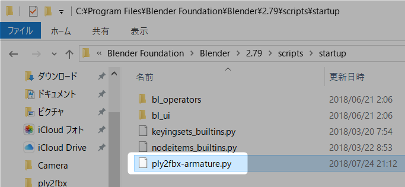
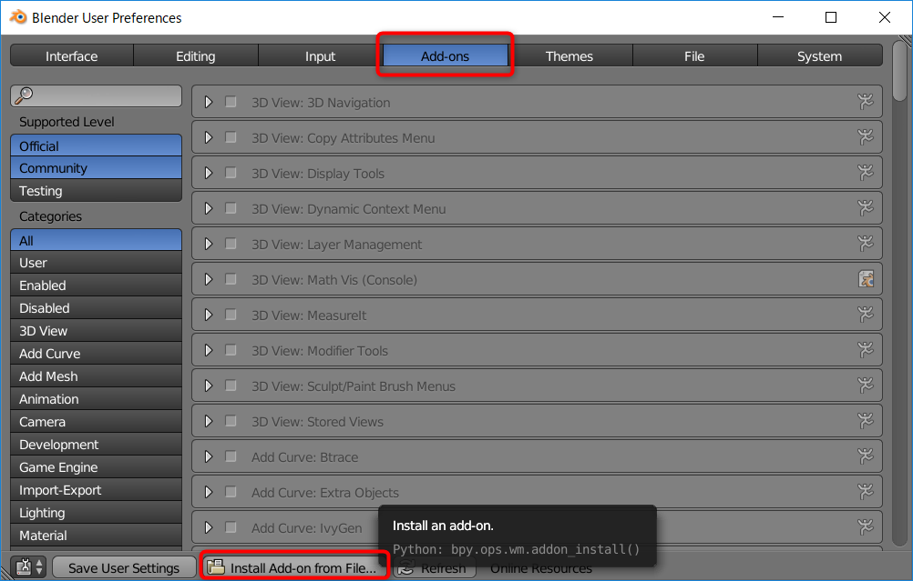
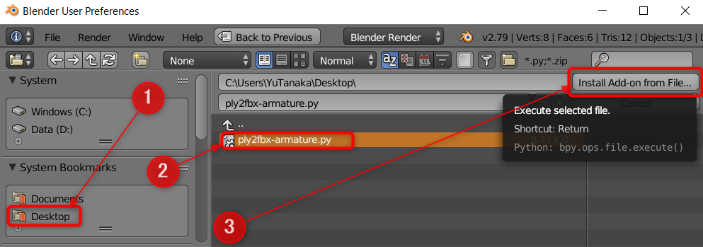
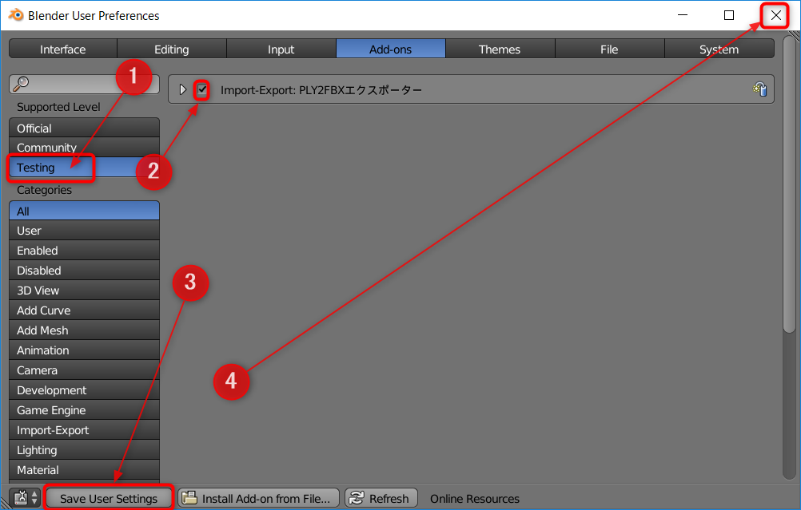
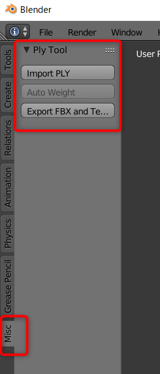
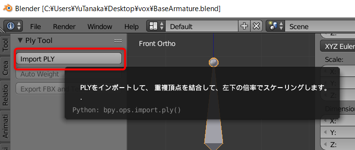
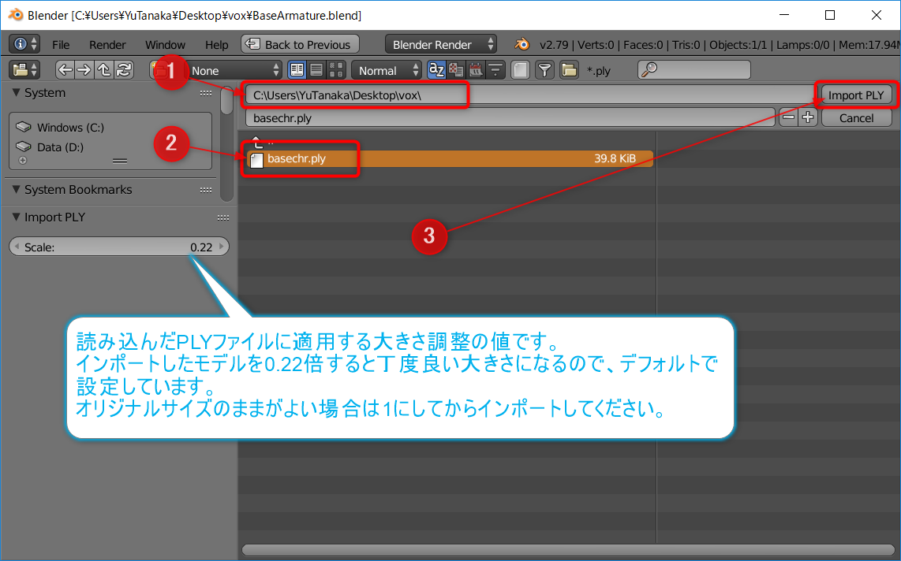
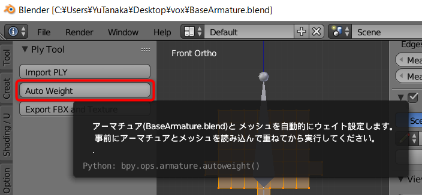
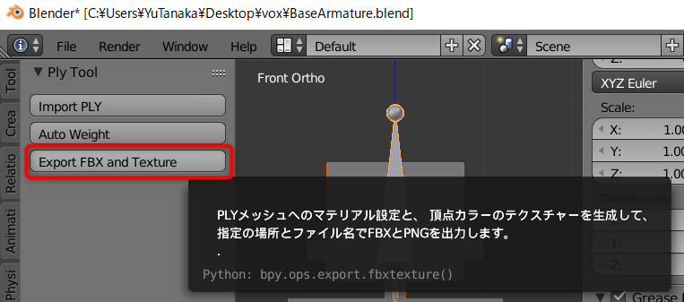
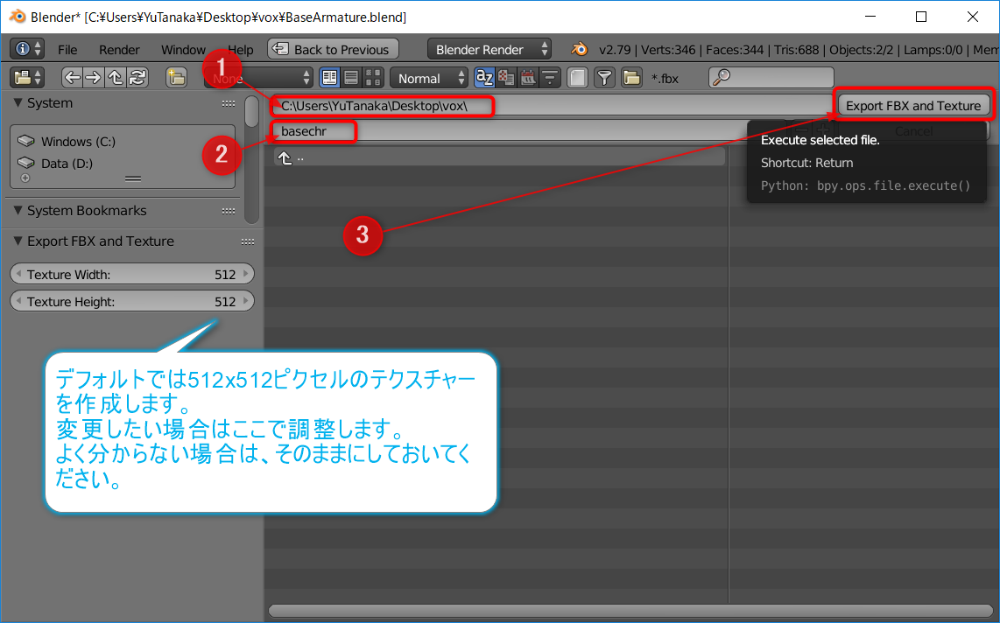

# PLY2FBX
**MagicaVoxel**で**PLY**形式で出力したボクセルのキャラクターにウェイトを設定して、テクスチャーを生成して、FBXとPNGを出力するBlender用のスクリプトです。

- v1.0.4(2018/8/30) インストール方法をアドオンからできるように改善
- v1.0.3(2018/8/30) エクスポート時にデータに含めるオブジェクトを選択する機能を追加

---

2通りの方法で、ウェイト設定をしたキャラクターを作ることができます。

- Blenderのみ利用する方法
  - だいし様の[MagicaVoxelで作ったプリキュアをUnityで動かす](https://github.dev7.jp/b/2015/12/15/precureadv20151213/)の記事で配布されているアーマチュアと素材を使って、ウェイト設定をして、FBXとPNGファイルをエクスポートする
- Blenderとmixamoを利用
  - BlenderでエクスポートしたテクスチャーとFBXファイルをZIP圧縮して、[mixamo](https://www.mixamo.com/)にアップロードしてウェイト設定とアニメーション付けをする

**PLY**形式のボクセルモデルのテクスチャーを作成して、FBXにエクスポートするのにも利用できます。

# バージョンアップする前に
**v1.0.4**からアドオンとしてインストールするように変更しました。**v1.0.3以前からバージョンアップする場合**は、以下の手順に従って`startup`フォルダーに入れた`ply2fbx-armature.py`を削除してください。

- Blenderが起動していたら閉じてください
- Windowsの場合、`C:\Program Files\Blender Foundation\Blender\2.79\scripts\startup`を開きます
- macの場合、Finderでアプリケーションを選択 -> blender-2.??-macOS-?? -> blenderを[Ctrl]+クリック -> パッケージの内容を表示 -> Contents -> Resources -> 2.79 -> scripts -> startupを開きます
- `ply2fbx-armature.py`を削除します(なければ大丈夫です)

# インストール
**Blender 2.79b**にインストールする手順です。Blenderはインストール済みとします。

- [こちら](https://github.com/am1tanaka/ply2fbx/releases)から最新バージョンの`ply2fbx-armature.py`を、分かりやすい場所(デスクトップなど)にダウンロードします
- Blenderを起動して、*File*メニューから*User Preferences*を選択します
- *Add-ons*を選択したら、*Install Add-on from File...*をクリックします

- ダウンロード先を指定したら、`ply2fbx-armature.py`を選択して、*Install Add-on from File...*ボタンをクリックします

- 左上から*Texting*をクリックして選択して、*Import Export: PLY2FBXエクスポーター*にチェックを入れて、左下の*Save User Settings*ボタンをクリックして状態を保存します

以上でインストール完了です。*Blender User Preferences*ウィンドは閉じて構いません。

左のパネルの一番下に*Misc*タブが追加されるのでクリックしてください。*Import PLY*, *Auto Weight*, *Export FBX and Texture*の3つのボタンが確認できればOKです。

<s>本来はAdd-onにした方がよい気もしましたが、詳しくないのでとりあえずStartupで読み込むようにしました。</s>(対応しました！2018/8/30)

タブ名の*Misc*もそのままです。気になるようでしたらMITライセンスですのでご自由に修正ください。プルリク歓迎！

# チュートリアル
詳しい利用手順は以下を参照ください。

- [MagicaVoxelのPLYファイルにウェイト設定してUnityでアニメーションさせる](http://am1tanaka.hatenablog.com/entry/2018/07/25/214935)
- [MagicaVoxelのPLYモデルにmixamoでアニメ設定をしてUnityで動かす](http://am1tanaka.hatenablog.com/entry/2018/07/25/224847)

# 使い方
## Import PLY

### 機能
以下の処理をします。

- PLYファイルをインポート
- 重複頂点を削除(Remove Doublesの実行)
- 原点を中心に、左下の*Scale*の倍率でモデルの大きさを変更

### 使い方

1. ファイルを読み込む場所を指定します
1. PLYファイルを選択します(上のファイル名欄にファイル名を入力してもよいです)
1. Importを実行するボタンです

### 自動スケーリング機能
MagicaVoxelでモデリングしたキャラクターをUnityに持っていくと、1ボクセル1ｍ換算されるので巨大になります。そこで、インポート時に自動的にそれっぽいサイズに縮小する機能をつけています。

左下の*Scale*欄の値で、モデルをインポートした後に大きさを変更します。デフォルトは`0.22`倍で、だいし様のブログで配布されている素体をこの設定で読み込むとベースアーマチュアと丁度よい大きさになります。

そのままのサイズで読み込む場合は`1`を設定するか、普通に*File*メニューの*Import*で読み込んでください。

## 自動ウェイト設定

### 機能
アーマチュアとキャラクターのメッシュを読み込んでいるとボタンが有効になります。以下を行います。

- メッシュとアーマチュアに親子関係を設定
- その際に、アーマチュアとメッシュに自動ウェイト設定

### 使い方
1. 事前にアーマチュアのblenderファイルと、キャラクターのメッシュをインポートしておきます
1. *Auto Weight*ボタンをクリックします

以上で、読み込まれているアーマチュアとメッシュを自動的に選択して、親子設定します。

**複数のアーマチュアやメッシュがあることは想定していないので、1体分で作業してください。**

## Export FBX and Texture

### 機能
PLYファイルをUnityで表示できるFBXにするために以下を実行します。

- 頂点カラーからテクスチャーを生成
- マテリアルを作成してアタッチ(マテリアルは白色に設定)
- 指定のフォルダーとファイル名で`FBX`と`PNG`ファイルをエクスポート

### 使い方
事前にPLYファイルをインポートしておきます

1. 保存先のフォルダーを設定します
2. ファイル名を入力します
3. *Export FBX and Texture*ボタンをクリックします

以上で、指定したフォルダーに、`ファイル名.fbx`と`ファイル名.png`が出力されます。

- Unityにインポートする場合
  - 出力された2つのファイルを選択して、まとめてUnityの*Project*ビューにドラッグ＆ドロップします
- mixamoにアップロードする場合
  - 出力された2つのファイルをZIP圧縮して、mixamoにアップロードします

### テクスチャーサイズの変更について
デフォルトでは`512`x`512`ピクセルのテクスチャーを生成します。このサイズはウィンドウの左下の`Texture Width`と`Texture Height`で変更できます。

ボクセル数が多いと、テクスチャーの解像度が足りなくなるかも知れません。その場合は、`1024`や`2048`に変更してみてください。

逆に、`512`も必要ない場合は、`128`や`256`に変更してみてください。

### データに含めるオブジェクトの選択
デフォルトでは、*CAMERA*と*LAMP*は含めないようになっています。含めたい場合は、FBXのファイル名を指定する画面の左下で、[Shift]キーを押しながら*CAMEAR*と*LAMP*をクリックして追加してください。

# 参考・関連URL
- [Blender](https://www.blender.org/)
- [MagicaVoxel](https://ephtracy.github.io/)
- [Blender 2.79.0 855d2955c49 - API documentation](https://docs.blender.org/api/2.79/)
- [だいし. MagicaVoxelで作ったプリキュアをUnityで動かす](https://github.dev7.jp/b/2015/12/15/precureadv20151213/)
- [裏鍵.dump. MagicaVoxel→Blender→Unityでボクセルモデルを動かす 改③（終）](http://urkgdmp.hatenadiary.jp/entry/2016/07/30/134028)
  - PLYのテクスチャー生成はこちらのブログを参考にしました

---
# ライセンス
[MIT License](./LICENSE)

Copyright (c) 2018 Yu Tanaka

Permission is hereby granted, free of charge, to any person obtaining a copy
of this software and associated documentation files (the "Software"), to deal
in the Software without restriction, including without limitation the rights
to use, copy, modify, merge, publish, distribute, sublicense, and/or sell
copies of the Software, and to permit persons to whom the Software is
furnished to do so, subject to the following conditions:

The above copyright notice and this permission notice shall be included in all
copies or substantial portions of the Software.

THE SOFTWARE IS PROVIDED "AS IS", WITHOUT WARRANTY OF ANY KIND, EXPRESS OR
IMPLIED, INCLUDING BUT NOT LIMITED TO THE WARRANTIES OF MERCHANTABILITY,
FITNESS FOR A PARTICULAR PURPOSE AND NONINFRINGEMENT. IN NO EVENT SHALL THE
AUTHORS OR COPYRIGHT HOLDERS BE LIABLE FOR ANY CLAIM, DAMAGES OR OTHER
LIABILITY, WHETHER IN AN ACTION OF CONTRACT, TORT OR OTHERWISE, ARISING FROM,
OUT OF OR IN CONNECTION WITH THE SOFTWARE OR THE USE OR OTHER DEALINGS IN THE
SOFTWARE.
