# PLY2FBX
**MagicaVoxel**で**PLY**形式で出力したボクセルのキャラクターにウェイトを設定して、テクスチャーを生成して、FBXとPNGを出力するBlender用のスクリプトです。

2通りの方法で、ウェイト設定をしたキャラクターを作ることができます。

- Blenderのみ利用する方法
  - だいし様の[MagicaVoxelで作ったプリキュアをUnityで動かす](https://github.dev7.jp/b/2015/12/15/precureadv20151213/)の記事で配布されているアーマチュアと素材を使って、ウェイト設定をして、FBXとPNGファイルをエクスポート
- Blenderとmixamoを利用
  - BlenderでエクスポートしたテクスチャーとFBXファイルをZIP圧縮して、[mixamo](https://www.mixamo.com/)にアップロードしてウェイト設定とアニメーション付けをする

**PLY**形式のボクセルモデルのテクスチャーを作成して、FBXにエクスポートするのにも利用できます。

# インストール
**Blender 2.79b**にインストールする手順です。Blenderはインストール済みとします。

- Blenderが起動していたら閉じておきます
- Blenderのインストールフォルダーを開いて、`scripts/startup`フォルダーを開きます
  - Windowsの場合、デフォルトのインストール先は`C:\Program Files\Blender Foundation\Blender\2.79\`です

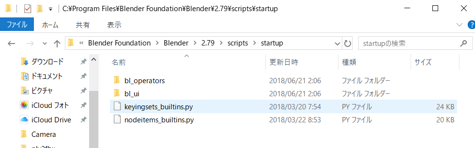
- [こちら](https://github.com/am1tanaka/ply2fbx/releases/download/v1.0.1/ply2fbx-armature.py)からダウンロードした`ply2fbx-armature.py`を、`startup`フォルダーにコピーします(コピーする時に、管理者パスワードが必要になる場合があります)

以上でインストール完了です。Blenderを起動して、Miscタブが追加されていて、3つのボタン(Import PLY, Auto Weight, Export FBX and Texture)が確認できればOKです。

> 本来はAdd-onにした方がよい気もしましたが、詳しくないのでとりあえずStartupで読み込むようにしました。タブ名の*Misc*もそのままです。気になるようでしたらMITライセンスですのでご自由に修正ください。プルリク歓迎！

# BlenderでヒューマノイドモデルのFBXとPNGを生成する
だいし様の[MagicaVoxelで作ったプリキュアをUnityで動かす](https://github.dev7.jp/b/2015/12/15/precureadv20151213/)の記事から、**MagicaVoxel用素体**(`base.vox`)と**素体用アーマチュア**(`BaseArmature.blend`)をダウンロードしてください

## MagicaVoxelでキャラクター作り
- [MagicaVoxel](https://ephtracy.github.io/)を起動して、base.voxを読み込みます
- 記事に従ってキャラクターを作成します(手順を確認する場合はbase.voxのままで構いません)
- キャラクターが完成したら、*Export* -> *ply*をクリックします

- 分かりやすい場所に任意のファイル名で保存します。ファイル名は半角英数のみ推奨(日本語や全角が混じったファイル名だとUnityで不具合が起きる可能性があります)

## アーマチュアとPLYの読み込み
ここからはBlenderでの作業です。必要なファイルを読み込みます。

- Blenderが起動していなければ起動します
- ダウンロードしてあった`BaseArmature.blend`をBlenderにドラッグ＆ドロップします

- 3D Viewの左のメニューから*Misc*タブをクリックします

- *Import PLY*ボタンをクリックします

- PLYファイルのフォルダーを設定して、読み込むファイルを選択して、*Import PLY*ボタンをクリックします

> デフォルトのPLYのサイズだと大きくなりすぎるので、アーマチュアとサイズが丁度良くなるようにサイズを0.22倍するようにしています。倍率は左下の*Scale*欄で設定できるので、読み込みと同時にサイズを調整したい場合は、値を変更してから*Import PLY*をクリックしてください。

PLYファイルのインポートが完了しました。

デフォルトのアーマチュアとbase.voxを使っていれば、大きさと位置が合っているはずです。もし、モデルとアーマチュアの配置がずれている場合は、縮小や移動をして上記のように重ねてから次に進んでください。

## ウェイト設定
Blenderでウェイトを設定する場合は、メッシュとアーマチュアを階層して親子設定をするのですが、それらは*Auto Weight*ボタンを押せば完了です。

以下のように、*Outliner*で*armature*の子供にメッシュが設定されていれば成功です。

## エクスポート
PLYはテクスチャーを持たないので、Unityで色を付けるにはテクスチャーをベイクする必要があります。また、マテリアルの作成も必要です。**面倒なので自動化しました。**

- *Export FBX and Texture*ボタンをクリックします

- エクスポート先とファイル名を設定したら*Export FBX and Texture*ボタンをクリックすれば完了です

> デフォルトで生成されるテクスチャーのサイズは512x512ピクセルです。ボクセル数が多いと足りないかも知れないので、Unityで見た時に色がずれているような場合は、*Texture Width*と*Texture Height*を`1024`や`2048`に変更してみてください。

> ボクセル数が少なくて、もっと小さいテクスチャーで構わない場合は`128`や`256`にしてみてください。テクスチャーのサイズは2のテクスチャーのサイズは2の累乗である必要があります(よく分からない場合は、この設定はいじらないでください)。

以上で完了です。出力先のフォルダーに、以下のように`fbx`と`png`の2つのファイルが出力されていれば成功です。

「Unityに読み込む」に進んで、動作確認をしてみてください。

# mixamoを利用する
キャラクターのサイズや体系がBaseArmatureと異なる場合などは、Adobe社が提供しているWebサービル[mixamo(ミクサモ)](https://www.mixamo.com/)の利用がオススメです。ここからは、mixamoでアニメーションを設定する手順です。

mixamoを利用するには、無料の会員登録(Sign up)が必要です。事前に登録してログインしておいてください。

## MagicaVoxelでキャラクターを作成する
この方法の場合は、`base.vox`から作業を開始する必要はありません。いわゆる[Tポーズ](https://www.google.co.jp/search?q=T%E3%83%9D%E3%83%BC%E3%82%BA&tbm=isch)になっていればOKです。

- キャラクターが完成したら、*Export* -> *ply*をクリックします

- 分かりやすい場所に任意のファイル名で保存します。ファイル名は半角英数のみ推奨(日本語や全角が混じったファイル名だとUnityで不具合が起きる可能性があります)

## BlenderでPLYをインポート
ここからはBlenderでの作業です。必要なファイルを読み込みます。

- Blenderが起動していなければ起動します。あるいは、*File*メニューから*New*を選択して、初期状態にします
- 既存の*Camera*, *Cube*, *Lamp*全て不要なので、[Shift]キーを押しながらクリックして3つとも選択します

- エディター上にマウスカーソルを移動させて、[Delete]キーを押して表示されるポップアップの*Delete*をクリックして、選択していたものを削除します

- 3D Viewの左のメニューで*Misc*タブをクリックして選択して、*Import PLY*ボタンをクリックします

- PLYファイルを保存したフォルダーを設定して、読み込むファイルを選択して、*Import PLY*ボタンをクリックします

> デフォルトのPLYのサイズだとUnityでは大きくなりすぎるので、0.22倍するようにしています。倍率は左下の*Scale*欄で設定できるので、読み込みと同時にサイズを調整したい場合は、値を変更してから*Import PLY*をクリックしてください。

PLYファイルのインポートが完了しました。

## FBXとPNGをエクスポート
mixamoを利用する場合は、Blenderでウェイト設定する必要はないので、このままFBXにエクスポートします。

- *Export FBX and Texture*ボタンをクリックします

- エクスポート先とファイル名を設定したら*Export FBX and Texture*ボタンをクリックすれば完了です

> デフォルトで生成されるテクスチャーのサイズは512x512ピクセルです。ボクセル数が多いと足りないかも知れないので、Unityで見た時に色がずれているような場合は、*Texture Width*と*Texture Height*を`1024`や`2048`に変更してみてください。

> ボクセル数が少なくて、もっと小さいテクスチャーで構わない場合は`128`や`256`にしてみてください。テクスチャーのサイズは2のテクスチャーのサイズは2の累乗である必要があります(よく分からない場合は、この設定はいじらないでください)。

以上で完了です。出力先のフォルダーに、以下のように`fbx`と`png`の2つのファイルが出力されていれば成功です。

## mixamoにモデルを読み込む
生成したFBXとPNGをmixamoにアップロードするには、ZIP圧縮しておく必要があります。

- `FBX`ファイルと`PNG`ファイルを選択して、右クリック -> *送る* -> *圧縮(zip形式)フォルダー*を選択します

FBXやPNGのあったフォルダーにZIPファイルが出来上がります。

- [mixamo](https://www.mixamo.com/)のページを開いて、ログインします
- *UPLOAD CHARACTER*ボタンをクリックします

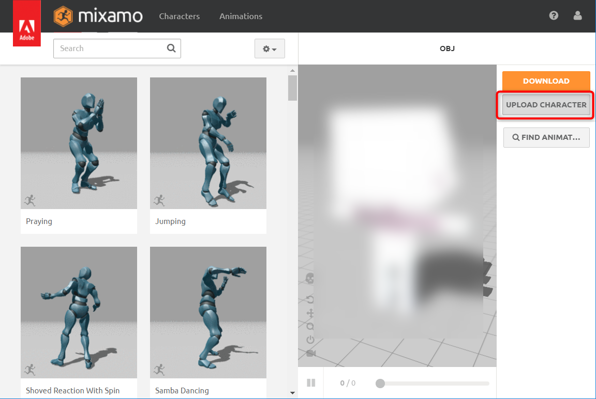

- 先ほど作成した*ZIP*ファイルをドラッグして、mixamoの点線の枠内にドロップします

- モデルが表示されます。こちらを向いて立っているのが確認できたら*NEXT*をクリックします
  - 変な方向を向いていたら、左下の矢印をクリックして、以下の画像のように調整してから*NEXT*をクリックしてください

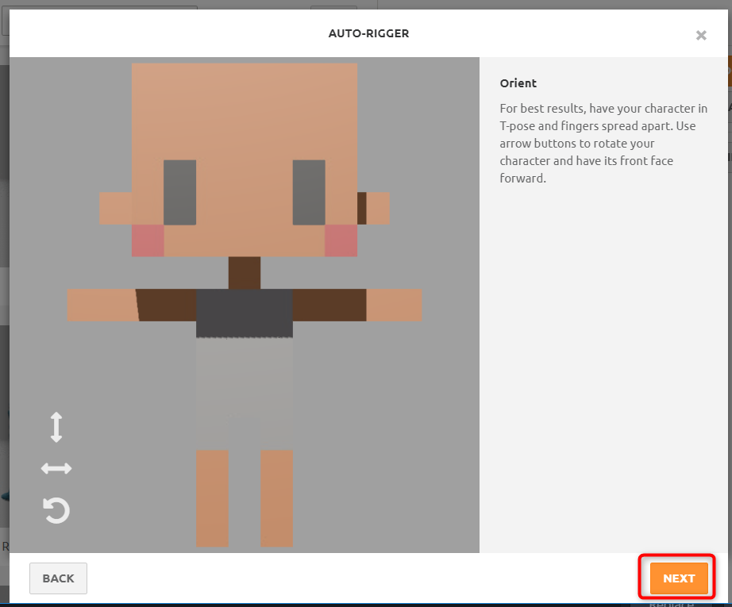

- 左下に並んでいる丸をドラッグして、キャラクターの該当する場所に設定します
  - 左右が分かりづらいので、以下を参考にしてみてください
  - (背景の色、変えられないだろうか...股の位置が見辛い...)

- 設定が完了したら*NEXT*をクリックします

キャラクターがくるくる回って、自動的にウェイトを設定する処理が行われます。完了を待ってください。

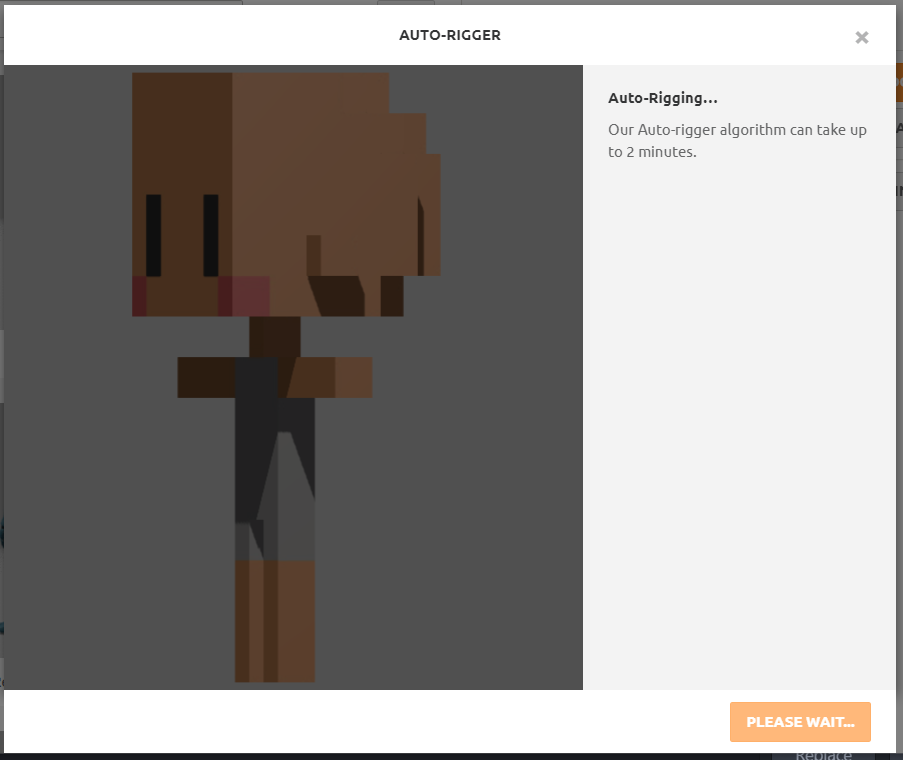

ウェイト設定が成功すると、アニメーションのデモが動きます。うまく動いていたら、*NEXT*ボタンをクリックします。

失敗していたら、*BACK*ボタンで戻って、間接の設定をし直してください。

色がおかしいのはUnityに持っていけば治るので放っておいて構いません。

以下の画面で*NEXT*をクリックしたら読み込み完了です。

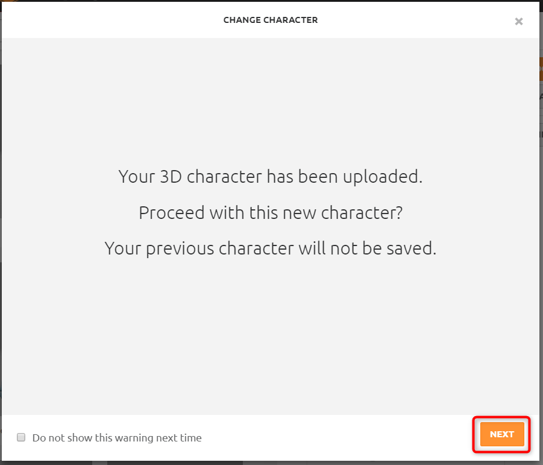

## アニメの作成とエクスポート
アップロードとウェイト設定が完了したら、以下の画面に切り替わります。

左でモーションの選択、右のパラメーターで腕の広げ方や速度などのアニメーションの微調整ができます。使い方は他の記事を検索してください。ここではそのままデータをダウンロードします。

- 右上の*DOWNLOAD*ボタンをクリックします
- 以下の設定をして、*DOWNLOAD*します
  - *Format*は、*FBX for Unity(.fbx)*
  - *Frame per Second*は、*60*がゲームの場合はよいと思います
  - あとはデフォルトで大丈夫そうです
  - 以上設定したら、*DOWNLOAD*ボタンをクリックします

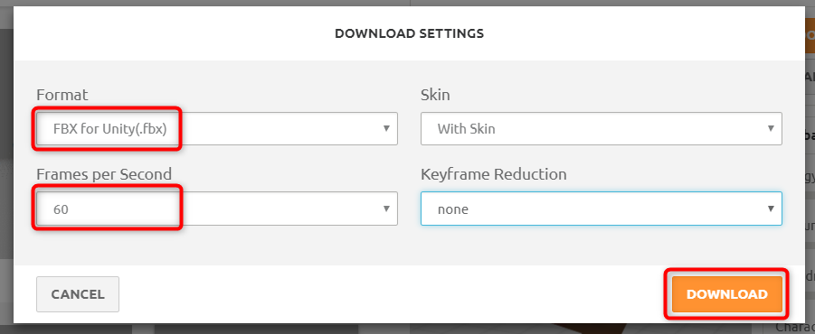

以上で、メッシュ、アニメーション、マテリアル、テクスチャーを埋め込んだFBXファイルをダウンロードできます。

あとは、Unityで動作確認をしましょう。

# Unityに読み込む
Unityに読み込んで動作テストしてみます。以下、前提です。

- Unity2018.1.3で確認(2017以降なら似たような操作でいけると思います)
- Standard Assetsインストール済み

Unityを起動して、確認用のプロジェクト(空のプロジェクトでよいです)を開きます。

- *Assets*メニューから*Import Package* -> *Characters*を選択して、*Import*します

- Blenderのみで出力した場合
  - エクスポートした`FBX`と`PNG`を[Ctrl]キーを押しながら選択して、まとめてUnityの*Project*ビューにドロップします

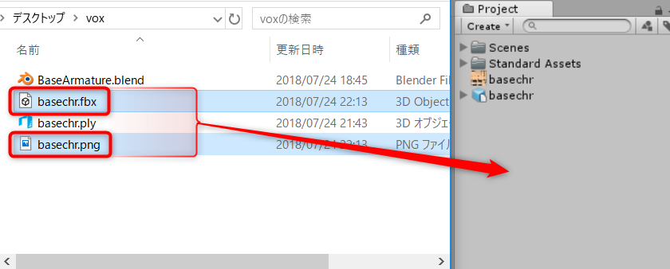

**注意！！ FBXとPNGファイルを同時にドラッグ＆ドロップしないとテクスチャーが貼られないので気を付けてください！！**

- mixamoを利用した場合
  - ダウンロードした`FBX`ファイルをドラッグして、Unityの*Project*ビューの読み込みたい場所にドロップします

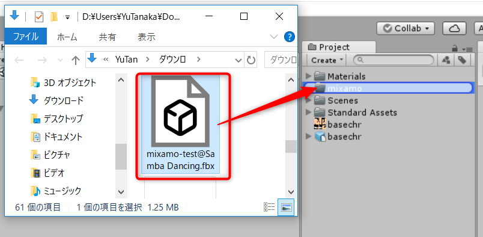

- *Project*ビューで読み込んだモデルをクリックして選択します
- *Inspector*ビューで、Materialsタブを選択して、*Extract Textures...*をクリックして、適当なフォルダーを選択します

- 同様に、*Extract Materials...*をクリックして、適当なフォルダーを選択します

---

- Projectビューで読み込んだPNGを選択して、以下を設定します
  - *Generate Mip Map*のチェックを外す
    - 小さくした時に変な線が出ることがあるので
  - *Wrap Mode*を*Clamp*に設定
    - 画像端のにじみ防止
  - *Filter Mode*を*Point(no filter)に設定
    - にじみ防止
  - 以上できたら、*Apply*ボタンをクリック

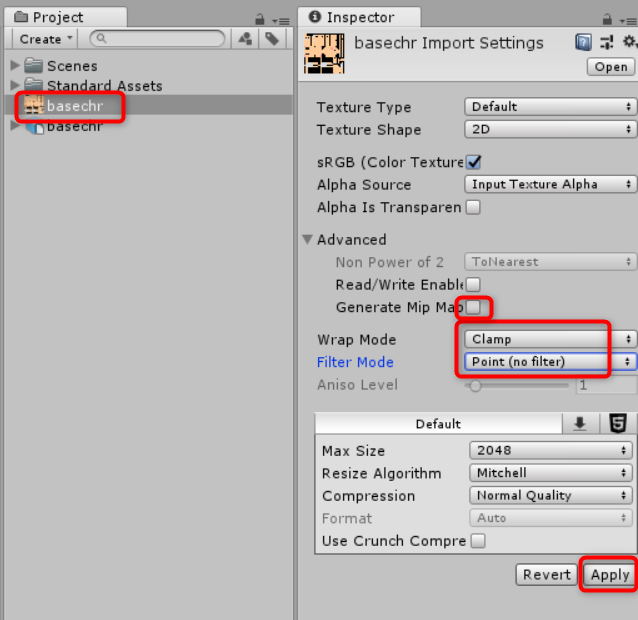

- Projectビューで読み込んだモデルを選択します
- *Model*について、以下を設定します
  - *Import Visibility*, *Import Cameras*, *Import Lights*のチェックを外す
    - くっついてませんが念のため
  - 設定したら*Apply*ボタンをクリック

- *Rig*について、以下を設定します
  - *Animation Type*を*Humanoid*に変更します
  - *Apply*ボタンをクリックします

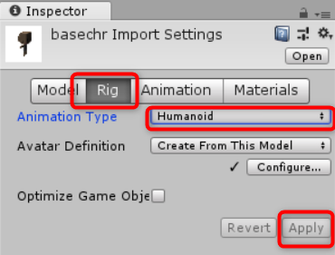

これで、*Configure...*の左にチェックが表示されれば成功です。これをやらないと、設定したアーマチュアなどの設定が反映されないので重要な設定です。

マテリアルを取り出します。

- *Materials*について、以下を設定します
  - *Extract Materials...*ボタンをクリックします

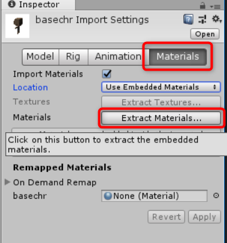

- 保存先のフォルダーを選択します。*Materials*フォルダーを作成して、そこを選択するとよいでしょう

キャラクターを作ります。

- *Hierarchy*ビューの*Create*をクリックして、*Craete Empty*で空のゲームオブジェクトを作成します

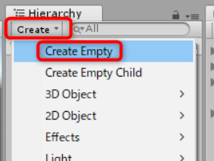

- 作成したオブジェクト名をキャラクターの名前などにするとよいでしょう(`Player`など)
- *Project*ビューからキャラクターのモデルをドラッグして、*Hierarchy*ビューに作成したゲームオブジェクトにドロップして、子供にします

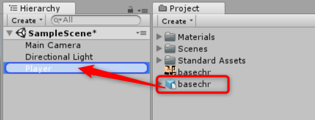

- *Hierarchy*ビューにドロップしたモデルをクリックして選択して、*Inspector*ビューで以下を確認＆設定します
  - *Transform*の*Position*・・・すべて`0`
  - *Rotation*・・・キャラクターを向かせたい方向(奥を向かせるのが一般的)
  - *Scale*・・・良さそうな大きさに調整

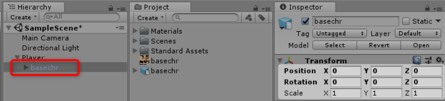

これでモデルが表示されます！

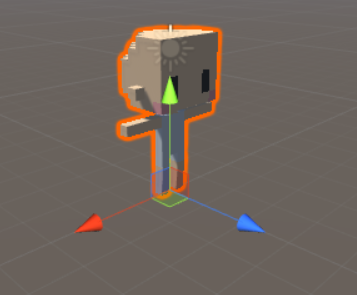

**注意！！　Rigidbodyをアタッチしたゲームオブジェクトの*Scale*は、必ず`1`にします。そうしないとRigidbodyの動作が破綻します。空のゲームオブジェクトを作って、モデルをその子供にしたのはモデルを調整しやすくするためです**

ただ、少し色が暗いので、マテリアルを調整しておきます。

- *Project*ビューで、保存したマテリアルを選択します

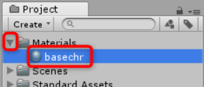

- *Inspector*ビューの*Albedo*の右の白い四角をクリックしてカラーパネルを表示したら、色を真っ白にして、*x*で閉じます

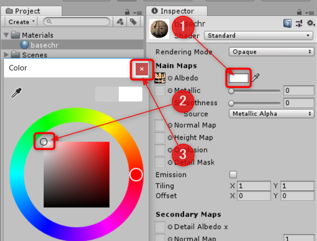

アニメーションを設定して、動かして見ましょう。

- *Hierarchy*ビューからキャラクターモデルを選択しておきます

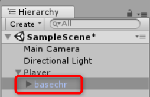

- *Project*ビューで、*Standard Assets* -> *Characters* -> *ThirdPersonCharacter* -> *Animator*の左の三角をクリックして開きます

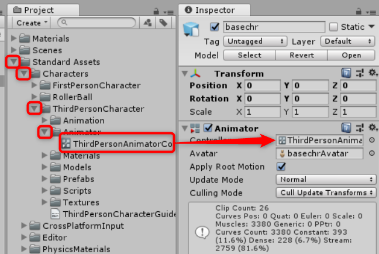

- *ThirdPersonAnimatorController*をドラッグして、*Inspector*ビューの*Controller*欄にドロップします
- テスト時に動かれると面倒なので、*Apply Root Motion*のチェックを外しておきます

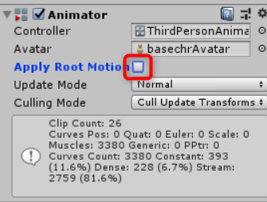

- *Project*ビューで*ThirdPersonAnimatorController*をダブルクリックします

- *Animator*ウィンドウが表示されるので、左にある*Parameters*をクリックして、パラメーターを表示します

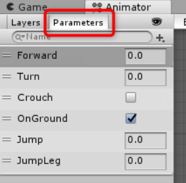

以上で準備完了です。Unityを*Play*してください。

*Animator*ウィンドウをクリックしてアクティブにしたら、パラメーターの値をいじってみてください。

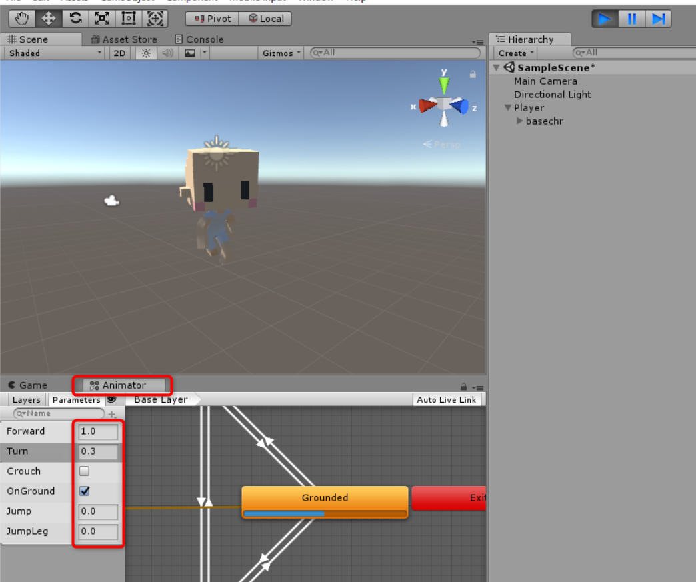

走ったり、しゃがんだり、アニメーションすることが確認できれば成功です。

# 参考・関連URL
- [Blender](https://www.blender.org/)
- [MagicaVoxel](https://ephtracy.github.io/)
- [Blender 2.79.0 855d2955c49 - API documentation](https://docs.blender.org/api/2.79/)
- [だいし. MagicaVoxelで作ったプリキュアをUnityで動かす](https://github.dev7.jp/b/2015/12/15/precureadv20151213/)
