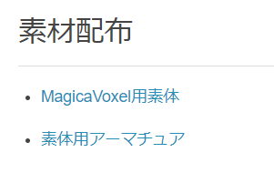
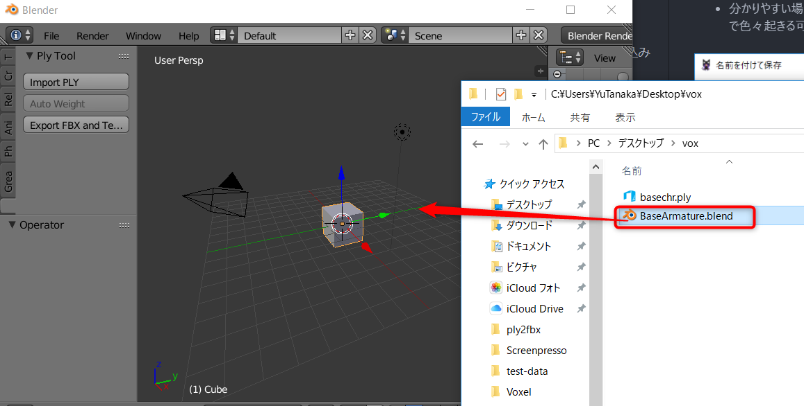
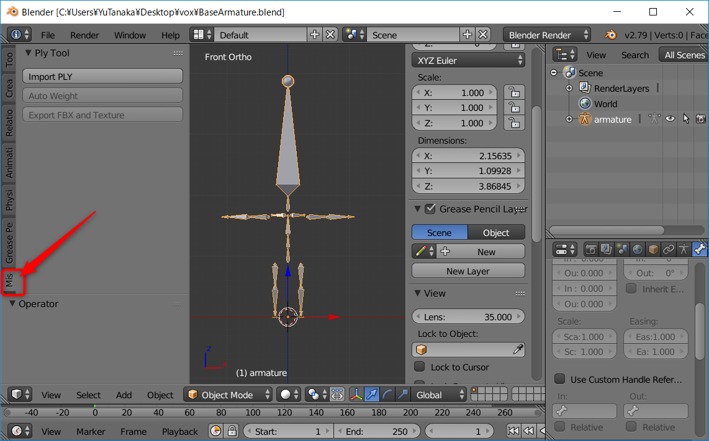
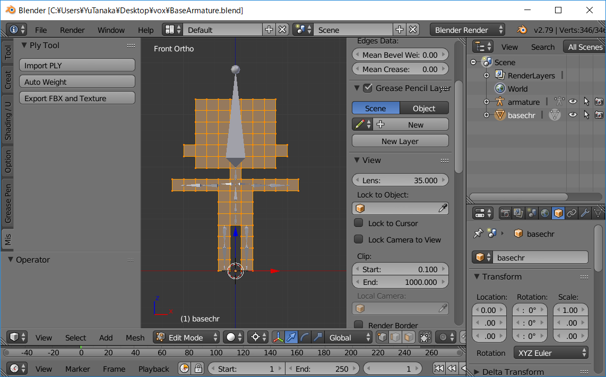
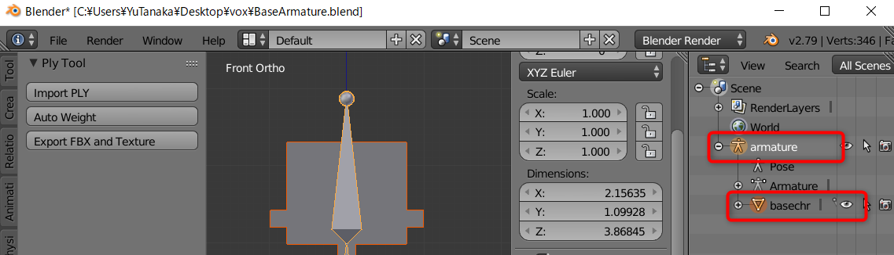

# BlenderでヒューマノイドモデルのFBXとPNGを生成する
だいし様の[MagicaVoxelで作ったプリキュアをUnityで動かす](https://github.dev7.jp/b/2015/12/15/precureadv20151213/)の記事に掲載されている**MagicaVoxel用素体**(`base.vox`)と**素体用アーマチュア**(`BaseArmature.blend`)を利用して、Blenderで自動ウェイト設定をして、FBXに出力して、Unityでテスト動作させる手順です。

# 準備
[MagicaVoxelで作ったプリキュアをUnityで動かす](https://github.dev7.jp/b/2015/12/15/precureadv20151213/)を開いて、**MagicaVoxel用素体**(`base.vox`)と**素体用アーマチュア**(`BaseArmature.blend`)をダウンロードしてください

# PLYファイルからウェイト設定したキャラクターモデルとテクスチャーをエクスポート

## MagicaVoxelでキャラクター作り
- [MagicaVoxel](https://ephtracy.github.io/)を起動して、base.voxを読み込みます
- 記事に従ってキャラクターを作成します(手順を確認する場合はbase.voxのままで構いません)
- キャラクターが完成したら、*Export* -> *ply*をクリックします

- 分かりやすい場所に任意のファイル名で保存します。ファイル名は半角英数のみ推奨(日本語や全角が混じったファイル名だとUnityで不具合が起きる可能性があります)

## アーマチュアとPLYの読み込み
ここからはBlenderでの作業です。必要なファイルを読み込みます。

- Blenderが起動していなければ起動します
- ダウンロードしてあった`BaseArmature.blend`をBlenderにドラッグ＆ドロップするなどして開きます

- 3D Viewの左のメニューから*Misc*タブをクリックします

- *Import PLY*ボタンをクリックします

- PLYファイルのフォルダーを設定して、読み込むファイルを選択して、*Import PLY*ボタンをクリックします

> デフォルトのPLYのサイズだと大きくなりすぎるので、アーマチュアとサイズが丁度良くなるようにサイズを0.22倍するようにしています。倍率は左下の*Scale*欄で設定できるので、読み込みと同時にサイズを調整したい場合は、値を変更してから*Import PLY*をクリックしてください。

PLYファイルのインポートが完了しました。

デフォルトのアーマチュアとbase.voxを使っていれば、大きさと位置が合っているはずです。もし、モデルとアーマチュアの配置がずれている場合は、縮小や移動をして上記のように重ねてから次に進んでください。

## ウェイト設定
Blenderでウェイトを設定する場合は、メッシュとアーマチュアを階層して親子設定をするのですが、それらを*Auto Weight*ボタンで自動化しました。

以下のように、*Outliner*で*armature*の子供にメッシュが設定されていれば成功です。

## エクスポート
PLYはテクスチャーを持たないので、Unityで色を付けるにはテクスチャーをベイクする必要があります。また、マテリアルの作成も必要です。そそれらの作業を自動的に実行します。

- *Export FBX and Texture*ボタンをクリックします

- エクスポート先とファイル名を設定したら*Export FBX and Texture*ボタンをクリックすれば完了です

> デフォルトで生成されるテクスチャーのサイズは512x512ピクセルです。ボクセル数が多いと足りないかも知れないので、Unityで見た時に色がずれているような場合は、*Texture Width*と*Texture Height*を`1024`や`2048`に変更してみてください。

> ボクセル数が少なくて、もっと小さいテクスチャーで構わない場合は`128`や`256`にしてみてください。テクスチャーのサイズは2のテクスチャーのサイズは2の累乗である必要があります。よく分からない場合は、この設定はいじらないでください。

以上で完了です。出力先のフォルダーに、以下のように`fbx`と`png`の2つのファイルが出力されていれば成功です。

# Unityで動作確認する
作成したモデルをUnityに読み込んで動かしてみましょう。以下、前提です。

- Unity2018.1.3で確認(2017以降なら似たような操作でいけると思います)
- Standard Assetsインストール済み

## テスト用シーンを作成する
Unityを起動して、確認用のプロジェクト(空のプロジェクトでよいです)を開きます。

- *Assets*メニューから*Import Package* -> *Characters*を選択して、*Import*します

- 地面用のPlaneを作成します。*Hierarchy*ビューの*Create*をクリックして、*3D Object* -> *Plane*を選択します

- *Hierarchy*ビューで作成した*Plane*をクリックして選択します
- *Inspector*ビューで、*Transform*の右の歯車アイコンをクイックして、*Reset*を選択して、場所を原点にしておきます

- *Plane*にマテリアルを設定して色を着けたり、*Main Camera*の位置を調整して、*Game*ビューでそれっぽく見えるようにします

- *Project*ビューで、*Standard Assets* -> *Characters* -> *ThirdPersonCharacter* -> *Prefabs*の左の三角アイコンをクリックして開きます

- *ThirdPersonController*プレハブをドラッグして、*Scene*ビューで良さそうな場所に配置します

テスト用のシーンができました。*Play*して、矢印キーや[A][S][D][W]キーでキャラクターを操作できます。

## 作成したキャラクターを設定
エクスポートしたキャラクターを読み込み、設定します。

- Blenderでエクスポートした`FBX`と`PNG`を[Ctrl]キーを押しながら選択して、まとめてUnityの*Project*ビューにドロップします

**注意！！ FBXとPNGファイルを同時にドラッグ＆ドロップしないとテクスチャーが貼られないので気を付けてください！！**

- *Project*ビューで、読み込んだPNGを選択して以下を設定します
  - *Generate Mip Map*のチェックを外す
    - 小さくした時に変な線が出ることがあるので
  - *Wrap Mode*を*Clamp*に設定
    - 画像端のにじみ防止
  - *Filter Mode*を*Point(no filter)に設定
    - にじみ防止
  - 以上できたら、*Apply*ボタンをクリック

- Projectビューで、読み込んだモデルをクリックして選択します

- *Model*について、以下を設定します
  - *Import Visibility*, *Import Cameras*, *Import Lights*のチェックを外す
    - くっついてませんが念のため
  - 設定したら*Apply*ボタンをクリック

- *Rig*について、以下を設定します
  - *Animation Type*を*Humanoid*に変更します
  - *Apply*ボタンをクリックします

これで、*Configure...*の左にチェックが表示されれば成功です。これをやらないと、設定したアーマチュアなどの設定が反映されないので重要な設定です。

以上でキャラクターの読み込みと設定完了です。

## プレイヤーに適用して動かす
読み込んだモデルをテスト用のキャラクターに差し替えて動かして見ましょう。

- *Hierarchy*ビューで、*ThirdPersonController*の左側の三角をクリックして開きます

- *Hierarchy*ビューで、[Shift]キーを押しながら、*EthanBody*, *EthanGlasses*, *EthanSkeleton*の3つを選択します

- *Inspector*ビューの左上のチェックを外して、選択したオブジェクトを無効にします

- *Project*ビューから読み込んだモデルをドラッグして、*Hierarchy*ビューの*ThirdPersonController*にドロップします

- *Hierarchy*ビューで、ドロップしたモデルをクリックして選択します

- *Inspector*ビューで、*Animator*の左のチェックを外して、モデルにくっついているアニメーターを無効にします

ThirdPersonControllerのアニメーターを作成したモデルで再生するようにします。

- *Project*ビューで、読み込んだモデルの左の三角をクリックして開いておきます

- *Hierarchy*ビューで、*ThirdPersonController*をクリックして選択します

- *Project*ビューからモデルの子供にある*Avatar*をドラッグして、*Inspector*ビューの*Avatar*欄にドロップします

これで、*ThirdPersonController*のアニメーターが、オリジナルキャラクターのアバターを制御するようになります。

*Play*して、矢印キーなどで操作してみてください。エクスポートに成功していたらアニメーションを確認できます。

## キャラクターの大きさを調整したい場合の注意点
動かして見るとちょっとキャラクターが大きすぎるようです。半分の大きさにしてみます。

重要なのは、**親のゲームオブジェクトのScaleを変更しないこと**です。変更するのは、子供にしたモデルのオブジェクトのScaleにしてください。以下の通りです。

RigidbodyをアタッチしているゲームオブジェクトのScaleは、必ず`1`にしておきます。これを守らないと当たり判定や動作で予想外の不具合を引き起こします。必ず守りましょう！

# まとめ
以上で、MagicaVoxelで作成したPLY形式のキャラクターにウェイト設定をして、Unityに読み込んで、テスト動作させることができました。

Unity側での作業も少々あるので、一瞬で完了できる、というほどではありませんが、かなり手軽にモデルの修正をして、Unityに持ってくることができるのではないかと思います。

ご活用いただければ幸いです。

# 参考・関連URL
- [Blender](https://www.blender.org/)
- [MagicaVoxel](https://ephtracy.github.io/)
- [Blender 2.79.0 855d2955c49 - API documentation](https://docs.blender.org/api/2.79/)
- [だいし. MagicaVoxelで作ったプリキュアをUnityで動かす](https://github.dev7.jp/b/2015/12/15/precureadv20151213/)
